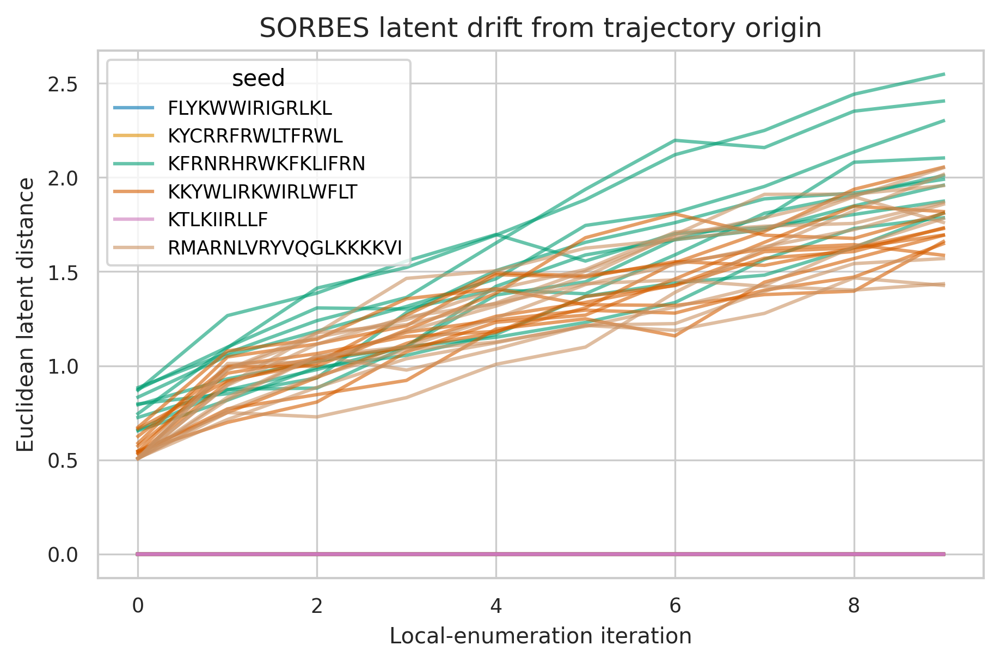
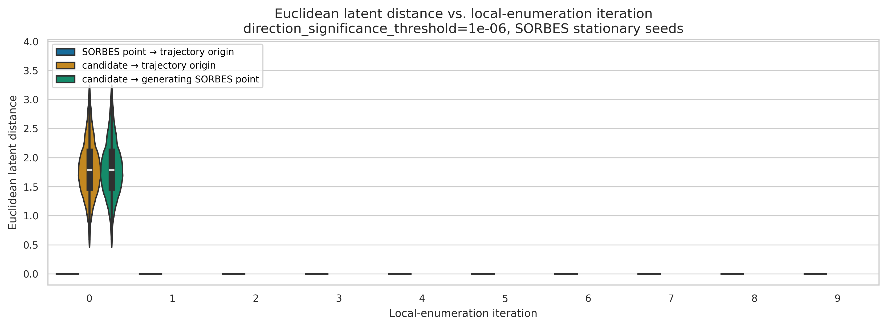
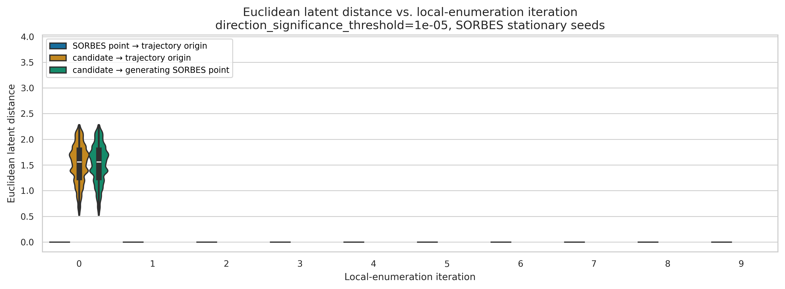
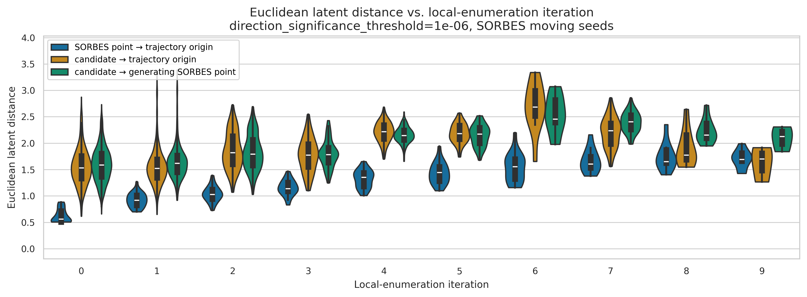
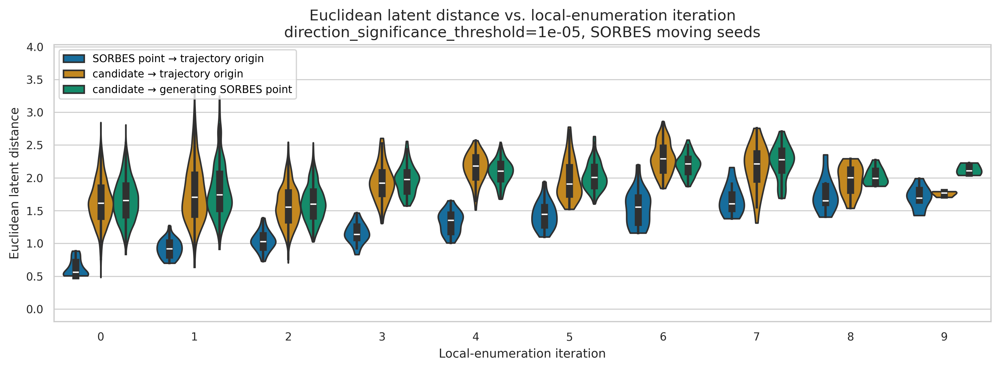
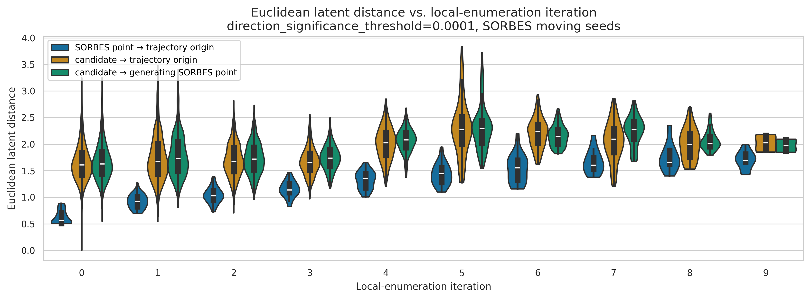

# Analiza lokalność

## Wstęp
Chcieliśmy sprawdzić czy sekwencje, czy sekwencje generowane przez mutang wychodzą poza *lokalne otoczenie* wyjściowego peptydu. 

Żeby to sprawdzić:
- wyznaczyłem odległość wewnątrz grupową (miedzy grupami na którym był trenowany HydraAMP - one powinny dzielić przestrzeń) 
- 

## Analiza 

### Analiza SORBES'a 
Żeby sprawdzić jak daleko się przemieszczamy za pomocą algorytmu *local-enumeration*, wziąłem 6 peptydów:
- KFRNRHRWKFKLIFRN
- KKYWLIRKWIRLWFLT
- RMARNLVRYVQGLKKKKVI
- FLYKWWIRIGRLKL
- KTLKIIRLLF
- KYCRRFRWLTFRWL

> Przypomnienie Algorytm SORBES:
> Algorytm SORBES dział tak, że:
> bierzemy sekwencje początkową 
> zaczynając od niej (punkt początkowy) tworzymy proces stochastyczny 
> po kazdej iteracji spaceru losowego generujemy w tym punkcie sekwencje mutangiem
> idziemy do następnego punktu 
> generujemy w następnym punkcie sekwencje itd.

Sprawdziłem które z nich są "stacjonarne", to jest, że SORBES nie generuje na nich trajektorii, widzimy też tutaj jak odległość 

Widzimy, że trzy stały się stacjonarne 

### Analiza odległości w przestrzeni ukrytej 

#### Wzrost odległości wraz z kolejnymi iteracjami
Wykresy przedstawiają 

Stacjonarny, można tutaj zaobserwować, że:
- dla większego thresholdu, odległość się zmniejsza,

W normalnym przypadku (nie stacjonarny), wyniki są odmienne. Rozkład odległości zwęża się dla progu $e1-05$, ale drastycznie rośnie dla progu $e1-04$, moim zdaniem może to wynikać z tego, że tutaj brane są tylko kierunku z większą odległością, dlatego nas wyrzuca.    

#### Metryka euklidesowa vs odległość levenstein'a 

## TMP 
#todo - trzeba porpawić te grupy 

flat ambinet distance - odległóści pomiędzy wektorami prawdopodibeńśtw oraz PoGSa na euklidowej metryce (dwa ploty) 

Końcowe analizy, trzeba zrobić tak, że porównujemy score'a modelu a nie latenta, problem, z encodowaneim, decodoewaniem 

- no debil, było sprwadzić jak HydraAMO enkoduje te sekwencje i jak bardzo różne wyniki dostajemy

Odległości ambientowe, PoGS'owe 

## Poprawy 
Trzeba porówanać odległóści po tych embeddingach, trzeba nei zafiksowywać conditioningu 
- trzeba odpowiednio ustawić kategorie żęby to ustawić 

## Nowy model
- autoencoder
  - ciągły latent
  - jak je wytrenować 
- jak to zrobić
  - trzeba na nim policzyć jacobian 

flow matching
- mając pole wektorowe odpalamy dyfeomorfizm z tą predkoścą 

Trenownie modele twierdzneie
- jeśli konstruuje batche punkty i najbliższe ppunkty w batchu (z perspektywy metryki) o robimy kamsymalna odległóśc to model uczy się odwzorowywac tangent), 
  - #TODO - możemy wtedy zrobić coś takiego do 
- jeśli przestrzeń od której starujemy jest płaska to do czegoś sesnwoengo zbiegniemy (co to znaczy żę jest płaska) 

ile jest peptydów w bazacnh dnayhc (par) które
- róznią się levensteinem o (1, 2, 3) 
    - możemy wtedy porówanc tak sekwencje, na batchu odpowiednio, wtedy dostajemy to co powinniśmy 
- 